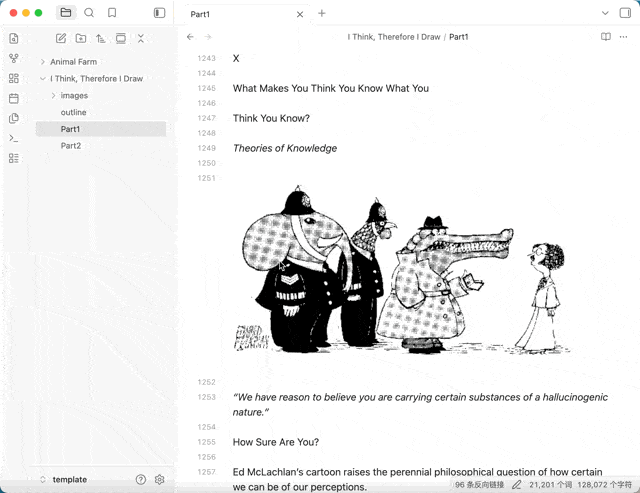

# Position Restore（位置恢复）

[English](README.md) | 简体中文

  

每次切回一篇笔记，还要手动翻找上次看到的地方？**Position Restore** 为每篇笔记记住光标与滚动位置，重新打开即落在原处——恢复在文件打开过程内完成，短暂空白之下先校准落点、确认稳定再揭开：无顶部闪跳，无二次跳动。亦可视为 Remember Cursor Position 插件的优化替代。

## 为什么选它

- **精确落位、无闪跳** — 恢复在文件打开过程内完成：位置应用与像素级校准都隐藏在短暂空白之下，确认稳定后才揭开；既没有"先顶部后跳转"的闪屏，也没有恢复后的二次跳动，揭开即精确呈现
- **光标、滚动一个不落** — 精确回到上次编辑的行列；记录随 vault 持久化，重启 Obsidian、换设备（同步 vault）都不丢
- **每个标签页独立记录位置** — 同一篇笔记开在多个标签页时，每个标签页各自记住自己的光标位置（设备本地）；重启后后台标签页会自动校准落点，而不会一直停在漂移位置直到首次激活
- **顺滑的打开体验** — 源码 / 阅读模式可分别选择立即恢复或平滑滚动（glide）恢复；可选恢复提示（面包屑），恢复完成后显示当前所在的目录层级位置
- **灵活的记录过滤** — 可指定排除文件夹（及其子文件夹）跳过记录，可设置最小行数让短文件（临时便签等）不记录位置，可按一个已存在的 frontmatter 属性（如 `publish: true`）排除整类文件，也可用单文件的 `position-restore` 属性单独开启或关闭某篇笔记
- **干净、可控的数据库** — 紧凑数组存储 + 自动按最近访问裁剪

## 功能与配置

| 配置项 | 说明 |
| --- | --- |
| 默认行为 | 无保存位置时：使用 Obsidian 默认行为，或跳转到文末 |
| 链接打开行为 | 打开 `[[链接]]` 时恢复保存位置，或总是从文件开头打开（标题/块锚点链接自动让位于链接目标） |
| 恢复方式（源码 / 阅读） | 分别可选**立即恢复**或**平滑滚动（glide）恢复** |
| 恢复提示 | 关 / 面包屑 / 面包屑+提示，恢复完成后显示当前所在的目录层级位置 |
| 排除文件夹 | 跳过指定文件夹（及其子文件夹）内的文件 |
| 最小行数过滤 | 短文件（临时便签等）不记录位置 |
| 按 frontmatter 属性排除 | frontmatter 匹配任一配置条目的文件一律不记录——条目可为属性名（`publish`，只要含该属性即排除），也可为 `属性: 值`（`publish: true`，仅当属性值匹配时才排除）。这些属性通常已为其他插件而存在，无需修改任何文件 |
| 单文件覆盖属性 | 任何文件都可在 frontmatter 中写 `position-restore: false` 单独关闭记录（优先于所有规则，并删除其已保存记录），或写 `position-restore: true` 强制记录（即使该文件在排除文件夹内、低于最小行数或命中了属性排除）；字符串形式的 `"false"` / `"true"` 同样生效（Obsidian 属性面板以文本类型存储时带引号），其他值一律忽略 |
| Bases 滚动记录 | 可选记录 Obsidian Bases 视图的滚动位置 |
| 数据库文件 | 存储路径可自定义，设置中可查看条目数量 |

### 记录过滤规则（按优先级从上到下，命中即停）

1. 文件 frontmatter 中写了 `position-restore: false` —— **绝不**记录该文件，并删除其已保存记录（优先于以下所有规则）
2. 写了 `position-restore: true` —— **总**记录该文件（优先于下面的文件夹、行数、属性规则）
3. 文件位于排除的文件夹（或其子文件夹）内
4. 文件行数低于最小行数过滤
5. 文件 frontmatter 匹配任一配置的排除条目 —— 条目可为裸属性名（`publish`，**只看属性是否存在**，不看值），也可为 `属性: 值`（`publish: true`，仅当属性值等于该值才排除；yes/no/on/off 视为布尔，数组命中任一元素即匹配）。这些属性通常已为其他插件而存在，因此无需修改任何文件

> 注意裸属性名：排除条目只写 `tags` 会匹配到几乎全部笔记。

## 安装

### 通过 Obsidian 社区插件市场安装（推荐）

1. 打开 **设置** → **第三方插件**，关闭安全模式（受限模式）
2. 点击 **浏览**，搜索 **Position Restore**
3. 点击 **安装** 并启用插件

### 手动安装

1. 从[发布页面](https://github.com/aisahpA/obsidian-position-restore/releases)下载最新版本的 `main.js`、`manifest.json`
2. 在你的仓库中创建 `.obsidian/plugins/position-restore/` 目录，把下载的文件复制进去
3. 重启 Obsidian，在 **设置** → **第三方插件** 中启用 **Position Restore**

## 从 Remember Cursor Position 迁移？

本插件与 [dy-sh/obsidian-remember-cursor-position](https://github.com/dy-sh/obsidian-remember-cursor-position) 的数据格式不同，位置数据不会自动迁移。两个插件同时启用会互相干扰位置恢复，建议安装本插件后禁用或卸载原插件；之后打开过的笔记会逐步建立自己的位置记录。

## 数据存储与隐私

- 位置数据保存在 vault 本地的 JSON 文件中（默认为插件目录下的 `positions.json`），路径可在设置中修改
- 不联网，不上传任何数据；数据库文件可随 vault 一起备份、同步

## 工作原理

每当你在笔记中移动光标或滚动时，插件都会记录当前状态。再次打开同一篇笔记时，插件在打开过程内应用保存的位置：短暂空白先遮住画面，落点经像素级校准、确认稳定后揭开——既看不到"先顶部后跳转"的闪屏，也不会有恢复后的二次跳动。源码模式（立即恢复）下，位置还会合并进 Obsidian 打开文件时的 ephemeral state，由原生恢复流程应用，即使标签在后台打开也已落位正确。每个标签页还会独立记录自己的位置（设备本地）：同一篇笔记开在多个标签页时，每个标签页都恢复到"这个标签页"上次所在的位置；重启后恢复出来的后台标签页会在各自的遮罩下自动校准，不会停在漂移位置直到首次激活。相比原插件"打开后延时跳转"的方式，恢复在打开过程中就已一次到位，从机制上避免了闪跳。

## 来源与致谢

本插件最初只想优化 [dy-sh/obsidian-remember-cursor-position](https://github.com/dy-sh/obsidian-remember-cursor-position) 的性能、补充一些配置，结果改动远超预期，最终重写并独立成了这个新插件；期间也参考了 [omeyenburg/obsidian-scrolling](https://github.com/omeyenburg/obsidian-scrolling) 项目。感谢这些项目的启发。

## 反馈与支持

- 遇到问题或有功能建议，欢迎[提交 Issue](https://github.com/aisahpA/obsidian-position-restore/issues)
- 如果这个插件对你有帮助，欢迎点一个 [Star](https://github.com/aisahpA/obsidian-position-restore) ⭐
